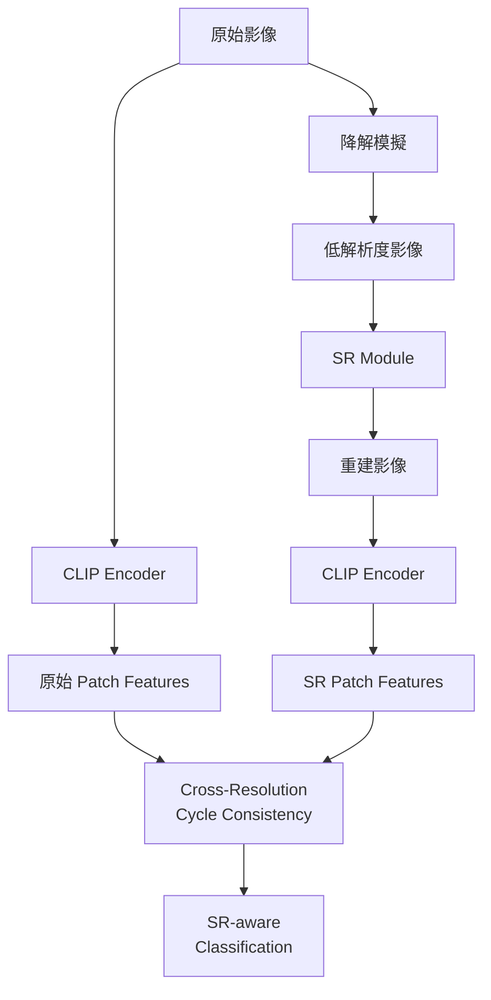

# 基於 CC-CDFSL 的超解析度 (Super-Resolution) 研究路線圖

## 你目前的基礎

你已經成功復現了 CC-CDFSL，具備以下關鍵組件：

| 組件 | 狀態 | 檔案 |
|------|------|------|
| CLIP ViT-B/16 backbone | ✅ 完成 | [clip_wrapper.py](file:///var/tmp/cc-cdfsl/models/clip_wrapper.py) |
| LoRA fine-tuning (r=4) | ✅ 完成 | [clip_lora.py](file:///var/tmp/cc-cdfsl/models/clip_lora.py) |
| Cycle Consistency Loss (T-I-T + I-T-I) | ✅ 完成 | [cycle_consistency.py](file:///var/tmp/cc-cdfsl/losses/cycle_consistency.py) |
| Semantic Anchor Module | ✅ 完成 | 整合在 cycle_consistency.py 中 |
| 4 個跨域資料集 | ✅ 完成 | CropDiseases, EuroSAT, ISIC2018, ChestX |
| 訓練好的 checkpoints (1-shot & 5-shot) | ✅ 完成 | [checkpoints/](file:///var/tmp/cc-cdfsl/checkpoints) |

---

## 為什麼 SR + CDFSL 是一個好的研究方向？

### 核心動機

CC-CDFSL 的目標域（target domain）資料集有幾個特性，使得 SR 非常有意義：

1. **醫學影像（ISIC, ChestX）**：實際臨床場景中影像解析度不一，低解析度嚴重影響局部特徵對齊
2. **衛星影像（EuroSAT）**：不同拍攝條件下解析度差異大
3. **CLIP 的 patch 特徵依賴解析度**：ViT-B/16 將 224×224 切成 14×14 = 196 個 patches，低解析度直接降低 patch 語義品質
4. **CC-CDFSL 的 Cycle Consistency 需要高品質局部特徵**：T-I-T 和 I-T-I 的 patch matching 品質與影像解析度直接相關

### 研究缺口

目前文獻中：
- Few-Shot Learning + SR 的結合研究較少
- Cross-Domain FSL + SR 幾乎是空白
- CLIP-based 方法中考慮解析度差異的工作極少

---

## 三個可能的研究方向

### 方向 A：SR 作為前處理增強（最容易，適合快速出結果）


**核心想法**：在 CLIP encoder 之前加入 SR 模組，提升輸入品質

**優點**：
- 實作最簡單，可直接使用現有 SR 模型（如 Real-ESRGAN, SwinIR）
- 不需改動 CC-CDFSL 的核心架構
- 可快速驗證 SR 對 few-shot 分類的影響

**缺點**：
- 創新性較低
- SR 和下游任務分離，無法端到端優化

---

### 方向 B：Feature-level SR（中等難度，較有新意）


**核心想法**：不在 pixel 層做 SR，而是在 CLIP 的 patch feature 空間做超解析度

**技術方案**：
- 將 ViT 的 14×14 patch grid 上採樣到 28×28 或更高
- 在 feature space 進行 interpolation + refinement
- 更多的 patches = 更精細的局部特徵 = 更好的 cycle consistency matching

**優點**：
- 直接優化對 CC-CDFSL 有幫助的特徵
- 可以端到端訓練
- 新穎性較高

**缺點**：
- 實作較複雜
- 需要設計 feature-level 的 SR 網路

---

### 方向 C：SR-guided Cycle Consistency（最有挑戰，最有創新）



**核心想法**：
- 設計「跨解析度循環一致性」：原始影像 patches ↔ SR 重建影像 patches 之間的 cycle consistency
- 擴展 CC-CDFSL 的 T-I-T 和 I-T-I cycle，加入 cross-resolution 維度
- 讓模型同時學習解析度不變的語義表徵

**新損失函數提案**：
```
L_total = L_CE + λ1 * L_cyc_txt + λ2 * L_cyc_img + λ3 * L_cyc_sr
```
其中 `L_cyc_sr` 確保跨解析度的局部語義一致性

**優點**：
- 高度創新，直接擴展 CC-CDFSL 的理論框架
- 解決 CDFSL 中的解析度域偏移問題
- 有足夠的新穎性發表

**缺點**：
- 實作難度最高
- 需要仔細設計損失函數和訓練策略

---

## 必讀論文清單

### 🔴 最優先（必須先讀）

| 論文 | 會議 | 為什麼要讀 |
|------|------|-----------|
| **SwinIR: Image Restoration Using Swin Transformer** (Liang et al.) | ICCV 2021 Workshop | ViT-based SR 的基礎架構，與你的 CLIP ViT backbone 最相容 |
| **Real-ESRGAN: Training Real-World Blind SR with Pure Synthetic Data** (Wang et al.) | ICCV 2021 Workshop | 實際場景 SR 的 SOTA，理解退化模型 |
| **CLIP-Driven Universal Model for Organ Segmentation and Tumor Detection** (Liu et al.) | ICCV 2023 | CLIP + 醫學影像，與你的 ISIC/ChestX 資料集直接相關 |

### 🟡 第二優先（確定方向後讀）

| 論文 | 會議 | 為什麼要讀 |
|------|------|-----------|
| **HAT: Hybrid Attention Transformer for Image Restoration** (Chen et al.) | CVPR 2023 | 結合 channel attention 和 window attention 的 SR |
| **TextSR / TPGSR** | 各種 | Text-guided SR，參考如何用文字引導 SR |
| **Diffusion-based SR 系列**（StableSR, DiffBIR） | 各種 | 如果想用更強大的生成式 SR |
| **Few-Shot Image Generation with Diffusion Models** | 各種 | Few-shot + 生成模型的結合 |

### 🟢 第三優先（深入研究時讀）

| 論文 | 會議 | 為什麼要讀 |
|------|------|-----------|
| **FeatUp: A Model-Agnostic Framework for Features at Any Resolution** (Fu et al.) | ICLR 2024 | 直接做 feature upsampling，與方向 B 高度相關 |
| **Any-Resolution Training for High-Resolution Image Synthesis** | 各種 | 多解析度訓練策略 |
| **LIIF: Learning Continuous Image Representation** (Chen et al.) | CVPR 2021 | 隱式神經表示做 SR，可能對 feature-level SR 有啟發 |
| **Self-Supervised Super-Resolution for Multi-Exposure Push-Frame Satellites** | CVPR 2022 | 衛星影像 SR，與 EuroSAT 直接相關 |

### 🔵 背景知識（視需要翻閱）

| 論文 | 為什麼有用 |
|------|-----------|
| CC-CDFSL 原論文（你已有 PDF） | 確認你的復現是否完整 |
| CLIP-LoRA (Zanella & Ayed, CVPR 2024) | 你的 baseline PEFT 方法 |
| EDSR, RCAN, SRResNet 等經典 SR 論文 | 建立 SR 基礎知識 |

---

## 建議的具體下一步

### Phase 1：驗證假設（1-2 週）

> [!IMPORTANT]
> 在正式開始之前，先做一個快速實驗來驗證「解析度確實影響 CC-CDFSL 效能」

1. **降解實驗**：
   - 將 4 個資料集的影像人工降解（bicubic downscale 到 56×56, 112×112 再 upscale 回 224×224）
   - 重新跑 CC-CDFSL 評估，觀察準確率下降幅度
   - 這可以量化「解析度」這個因素的影響力

2. **Pre-trained SR 實驗**：
   - 用 Real-ESRGAN 或 SwinIR 先將降解影像恢復
   - 再跑 CC-CDFSL 評估
   - 比較：降解前 vs 降解後 vs SR 恢復後 的準確率

### Phase 2：確定研究方向（1 週）

根據 Phase 1 的結果：
- 如果 SR 恢復後準確率大幅提升 → 方向 A 或 C 更有價值
- 如果 pixel-level SR 幫助有限 → 方向 B（feature-level）更有意義
- 選定方向後，深入讀對應的論文

### Phase 3：核心開發（4-6 週）

根據選定的方向進行實作（建議在現有 codebase 上擴展）

### Phase 4：實驗與論文（4-6 週）

- Ablation study
- 與 SOTA 比較
- 論文撰寫

---

## 需要你確認的問題

> [!WARNING]
> 以下問題會影響研究方向的選擇，請考慮後回覆：

1. **你的 GPU 資源如何？** 如果 GPU 記憶體有限（< 16GB），某些方向（如 Diffusion-based SR）可能不太實際
2. **你的目標是什麼？** 是要：
   - (a) 發表一篇頂會論文（需要高創新性，推薦方向 C）
   - (b) 碩士論文的一個章節（方向 B 即可）
   - (c) 快速產出實驗結果（方向 A 最快）
3. **你對 SR 領域的熟悉程度？** 這會影響建議的論文閱讀順序和實作難度評估
4. **時間限制？** 你有多少時間做這個研究？
